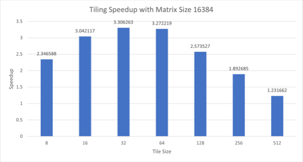
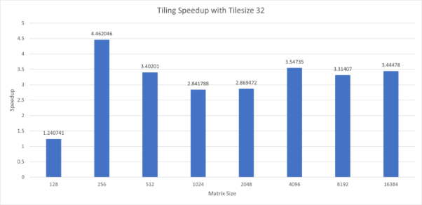
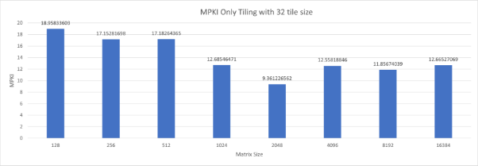
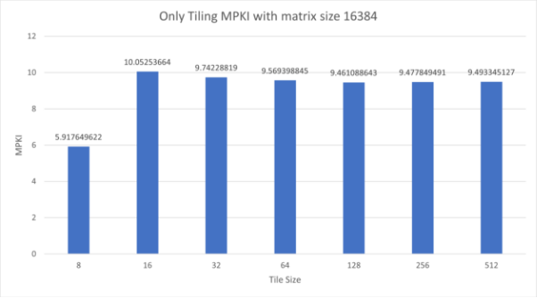
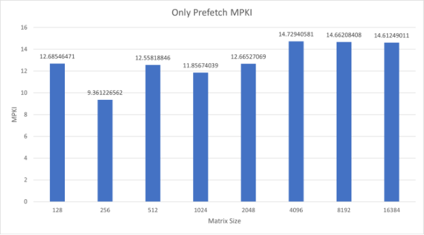
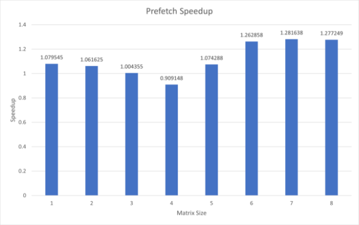
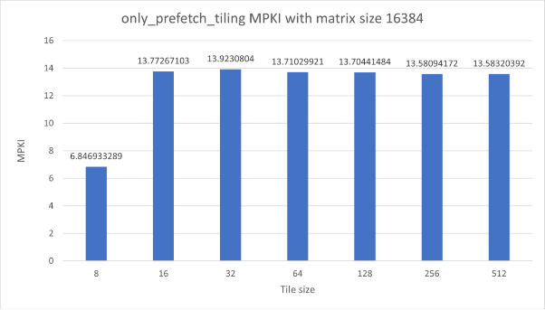
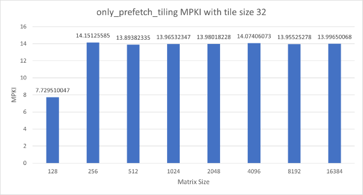
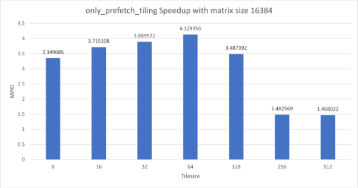
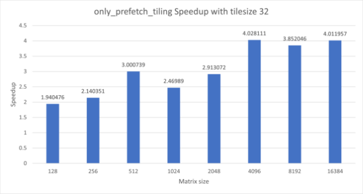



**CS683 – Advanced Computer Architecture**

**Programming Assignment 1 - Chak De Microarchitecture!**

|**Pasham Pranay**|**S Naresh**|
| :-: | :-: |
|**23M1123**|**23M1200**|
|23m1123@iitb.ac.in|23m1200@iitb.ac.in|

Indian Institute of Technology, Bombay

02-09-2024

# Table of Contents
[1	Introduction	4](#_toc176166969)

[2	TASK1	4](#_toc176166970)

[2.1	Task_1A_Tile_it_to_see_it	4](#_toc176166971)

[2.2	Task_1B_ Software_prefetching	4](#_toc176166972)

[2.3	Task_1C_Tiling_Prefetching	4](#_toc176166973)

**List of Figures:**

**No table of figures entries found.**

**List of Tables:**

**No table of figures entries found.**

1. # **Introduction**
In this programming assignment, we implemented various types of matrix transpose and 2D convolution computations with a focus on memory architecture optimization. We utilized techniques such as tiling, software prefetching, and SIMD (Single Instruction Multiple Data) instructions. All results were analysed using the perf tool and appropriately plotted.
1. # **TASK1**

1. ## **Task\_1A\_Tile\_it\_to\_see\_it**
TODOs:

1\. Report the L1-D cache MPKI when executing only the naive matrix transpose.

|Subtask|Matrix Size|Tile Size|#Instructions|L1D misses|MPKI|Time taken|
| :- | :- | :- | :- | :- | :- | :- |
||||||||
|Only\_naive|128|-|3485844|38378|11\.00967226|0\.000155|
|Only\_naive|256|-|10464012|151352|14\.46405069|0\.000743|
|Only\_naive|512|-|38433981|531669|13\.83330548|0\.004306|
|Only\_naive|1024|-|150040603|1985309|13\.23181166|0\.014739|
|Only\_naive|2048|-|595603691|8883183|14\.91458689|0\.091646|
|Only\_naive|4096|-|2385050456|45216588|18\.95833603|0\.389373|
|Only\_naive|8192|-|9567746640|164113807|17\.15281698|1\.531687|
|Only\_naive|16384|-|38303082308|658148214|17\.18264365|6\.665323|

2\. Implement the tiled matrix transpose. 

Implemented. Please refer to transpose.c

3\. Report the L1-D cache MPKI when executing only the tiled matrix transpose.

|Subtask|Matrix Size|Tile Size|#Instructions|L1D misses|MPKI|Time taken|
| :- | :- | :- | :- | :- | :- | :- |
||||||||
|only\_tiling|128|32|3900645|28407|7\.282641717|0\.000077|
|only\_tiling|256|32|12138998|119540|9\.847600271|0\.00024|
|only\_tiling|512|32|45077273|440394|9\.769756924|0\.001587|
|only\_tiling|1024|32|176802373|1716272|9\.707290524|0\.005108|
|only\_tiling|2048|32|703018319|6845209|9\.736885676|0\.022346|
|only\_tiling|4096|32|2822755916|27605837|9\.779746397|0\.110915|
|only\_tiling|8192|32|11320629485|110724854|9\.780803633|0\.44257|
|only\_tiling|16384|32|45315528127|440192037|9\.713933726|1\.930082|
|only\_tiling|16384|8|45721279101|270562510|5\.917649622|2\.823611|
|only\_tiling|16384|16|45442908040|456816498|10\.05253664|2\.243349|
|only\_tiling|16384|32|45313504834|441457223|9\.74228819|1\.940978|
|only\_tiling|16384|64|45255400995|433066982|9\.569398845|2\.005246|
|only\_tiling|16384|128|45227438103|427900801|9\.461088643|2\.524508|
|only\_tiling|16384|256|45222448659|428611562|9\.477849491|4\.139685|
|only\_tiling|16384|512|45219380237|429283183|9\.493345127|4\.945008|

4\. Compare the performance by calculating the speedup & 5. Do this for multiple matrix sizes and tile sizes and analyze the results.

|Subtask|Matrix Size|Tile Size|#Instructions|L1D misses|MPKI|Naïve Time|Technique time|Speedup|
| :- | :- | :- | :- | :- | :- | :- | :- | :- |
|tiling\_speed|128|32|4801453|58928|17\.82694|0\.000134|0\.000108|1\.240741|
|tiling\_speed|256|32|15662583|211086|13\.05261|0\.001352|0\.000303|4\.462046|
|tiling\_speed|512|32|59130275|809595|17\.22474|0\.004739|0\.001393|3\.40201|
|tiling\_speed|1024|32|232909870|3612351|18\.92972|0\.015573|0\.00548|2\.841788|
|tiling\_speed|2048|32|926705936|15517508|21\.66509|0\.090067|0\.031388|2\.869472|
|tiling\_speed|4096|32|3717687116|67892604|21\.64354|0\.434561|0\.122503|3\.54735|
|tiling\_speed|8192|32|14896959205|2\.71E+08|21\.6486|1\.577335|0\.475951|3\.31407|
|tiling\_speed|16384|32|59611455799|1\.09E+09|12\.27295|7\.196359|2\.089062|3\.44478|
||||||||||
|tiling\_speed|16384|8|60015267078|9\.15E+08|13\.47709|6\.450709|2\.748974|2\.346588|
|tiling\_speed|16384|16|59739784231|1\.1E+09|13\.69172|7\.066772|2\.323291|3\.042117|
|tiling\_speed|16384|32|59611856813|1\.08E+09|15\.50965|6\.787324|2\.052869|3\.306263|
|tiling\_speed|16384|64|59550272976|1\.08E+09|16\.7448|6\.913622|2\.112824|3\.272219|
|tiling\_speed|16384|128|59525949352|1\.07E+09|18\.26205|6\.871717|2\.670155|2\.573527|
|tiling\_speed|16384|256|59511770421|1\.07E+09|18\.18777|6\.667001|3\.522503|1\.892685|
|tiling\_speed|16384|512|59512534764|1\.07E+09|18\.2192|6\.840065|5\.553526|1\.231662|

6\. Plot the MPKI and speedup for different matrix sizes and tile sizes of your choice. Select the sizes such that you can draw clear conclusions from the results.

Answer the following: 

1\. Report the changes in L1-D MPKI that you observed while moving from the naive to the tiled matrix transpose, and argue. 

Ans: The L1-D MPKI decreased significantly when moving from the naive matrix transpose to the tiled matrix transpose, especially for larger matrix sizes. This happened because Tiling improves data locality, reducing the number of cache misses by ensuring that data that will be accessed soon is kept in the cache longer.

2\. How much did the L1-D MPKI change for different matrix sizes and tile sizes? Explain the findings. 

Ans: With tiling, the MPKI is consistently lower compared to the naive approach for the same matrix sizes. Tiling significantly reduces L1-D MPKI across all matrix sizes. Smaller tiles have lower MPKI but may increase computation overhead, while larger tiles reduce overhead but can raise MPKI. So, there is a trade-off in choosing tile sizes.

3\. Did you achieve any speedup? If so, how much and what contributed to it? If not, what were the reasons?

Ans: Yes, the tiled implementation achieved a speedup, with the highest being about 4.46x for a 256x256 matrix using a tile size of 32. This speedup was mainly due to fewer L1-D cache misses. As the tile size got larger, the speedup generally decreased. This happened because the benefits of better data locality started to diminish. For very large tiles, the speedup was lower or even negative compared to smaller tiles, likely because of more cache conflicts.
1. ## **Task\_1B\_Prefetching**
TODOs 

1\. Report the number of instructions and L1-D cache MPKI when executing only the naive matrix transpose. 

|Subtask|Matrix Size|Tile Size|#Instructions|L1D misses|MPKI|Time taken|
| :- | :- | :- | :- | :- | :- | :- |
||||||||
|Only\_naive|128|-|3485844|38378|11\.00967226|0\.000155|
|Only\_naive|256|-|10464012|151352|14\.46405069|0\.000743|
|Only\_naive|512|-|38433981|531669|13\.83330548|0\.004306|
|Only\_naive|1024|-|150040603|1985309|13\.23181166|0\.014739|
|Only\_naive|2048|-|595603691|8883183|14\.91458689|0\.091646|
|Only\_naive|4096|-|2385050456|45216588|18\.95833603|0\.389373|
|Only\_naive|8192|-|9567746640|164113807|17\.15281698|1\.531687|
|Only\_naive|16384|-|38303082308|658148214|17\.18264365|6\.665323|

2\. Implement the software-prefetched matrix transpose.

Implemented. Please refer to transpose.c 

3\. Report the number of instructions and L1-D cache MPKI when executing only the software-prefetched matrix transpose. 

|Subtask|Matrix Size|Tile Size|#Instructions|L1D misses|MPKI|Time taken|
| :- | :- | :- | :- | :- | :- | :- |
||||||||
|only\_prefetch|128|-|4047940|51350|12\.68546471|0\.000121|
|only\_prefetch|256|-|12734656|119212|9\.361226562|0\.001067|
|only\_prefetch|512|-|47420056|595510|12\.55818846|0\.003637|
|only\_prefetch|1024|-|185898310|2204148|11\.85674039|0\.014281|
|only\_prefetch|2048|-|739512106|9366121|12\.66527069|0\.075713|
|only\_prefetch|4096|-|2969122554|43733411|14\.72940581|0\.323777|
|only\_prefetch|8192|-|11901195630|174496331|14\.66208408|1\.279374|
|only\_prefetch|16384|-|47634563090|696059582|14\.61249011|5\.042515|

4\. Compare the performance by calculating the speedup. & 5. Do this for multiple matrix sizes and analyze the results. 

|Subtask|Matrix Size|Tile Size|#Instructions|L1D misses|MPKI|Naïve Time|Technique time|Speedup|
| :- | :- | :- | :- | :- | :- | :- | :- | :- |
||||||||||
|prefetch\_speed|128||4930196|70890|17\.82694|0\.000095|0\.000088|1\.079545|
|prefetch\_speed|256||16227296|289283|13\.05261|0\.000758|0\.000714|1\.061625|
|prefetch\_speed|512||61289122|799983|17\.22474|0\.00369|0\.003674|1\.004355|
|prefetch\_speed|1024||241393714|4157944|18\.92972|0\.01452|0\.015971|0\.909148|
|prefetch\_speed|2048||962647196|18222644|21\.66509|0\.088415|0\.082301|1\.074288|
|prefetch\_speed|4096||3863532753|83703777|21\.64354|0\.411597|0\.325925|1\.262858|
|prefetch\_speed|8192||15479020605|3\.35E+08|21\.6486|1\.569016|1\.224227|1\.281638|
|prefetch\_speed|16384||61919604583|1\.34E+09|12\.27295|6\.589215|5\.158913|1\.277249|

6\. Plot the MPKI and speedup for different matrix sizes of your choice. Select matrix sizes such that you can draw clear conclusions from the results. 

Answer the following: 

1\. Report the change in the number of instructions that you observed while moving from naive to the software-prefetched matrix transpose, and argue. 

Ans: Moving from the naive matrix transpose to the software-prefetched matrix transpose, there was a noticeable increase in the number of instructions executed. For example, with a 128x128 matrix, the number of instructions increased from 3,485,844 in the naive approach to 4,047,940 in the prefetched version. This increase is due to the additional prefetching instructions inserted into the code.

2\. Report the change in L1-D MPKI that you observed while moving from the naive to the software-prefetched matrix transpose, and argue. 

Ans: The L1-D cache MPKI generally decreased when moving from the naive to the software-prefetched matrix transpose, especially for larger matrix sizes. For example, with a 256x256 matrix, the MPKI decreased from 14.46 in the naive approach to 9.36 in the prefetched approach. So, software prefetching mitigated cache misses by ensuring that data is loaded into the cache before it is needed, reducing the number of cache misses during execution.

3\. Did you achieve any speedup? If so, how much and what contributed to it? If not, what were the reasons?

Ans: Yes, software prefetching generally made things faster, especially for larger matrices. For example, with an 8192x8192 matrix, we saw a 1.28x speedup. This improvement came mainly from fewer cache misses and better cache use due to prefetching. However, for smaller matrices, like the 1024x1024 one, prefetching sometimes caused more overhead than benefit, leading speedup of 0.91x. So, prefetching helps with larger matrices but might not be worth it for smaller ones where the basic method works well.

1. ## **Task\_1C\_Tiling\_Prefetching**
TODOs 

1\. Report the number of instructions and L1-D cache MPKI when executing only the naive matrix transpose. 

|Subtask|Matrix Size|Tile Size|#Instructions|L1D misses|MPKI|Time taken|
| :- | :- | :- | :- | :- | :- | :- |
||||||||
|Only\_naive|128|-|3485844|38378|11\.00967226|0\.000155|
|Only\_naive|256|-|10464012|151352|14\.46405069|0\.000743|
|Only\_naive|512|-|38433981|531669|13\.83330548|0\.004306|
|Only\_naive|1024|-|150040603|1985309|13\.23181166|0\.014739|
|Only\_naive|2048|-|595603691|8883183|14\.91458689|0\.091646|
|Only\_naive|4096|-|2385050456|45216588|18\.95833603|0\.389373|
|Only\_naive|8192|-|9567746640|164113807|17\.15281698|1\.531687|
|Only\_naive|16384|-|38303082308|658148214|17\.18264365|6\.665323|

2\. Implement the tiled + software-prefetched matrix transpose. 

Implemented. Please refer to transpose.c 

3\. Report the number of instructions and L1-D cache MPKI when executing only the tiled + software-prefetched matrix transpose. 

|Subtask|Matrix Size|Tile Size|#Instructions|L1D misses|MPKI|Time taken|
| :- | :- | :- | :- | :- | :- | :- |
||||||||
|only\_prefetch\_tiling|128|32|4265859|32973|20\.74418|0\.000067|
|only\_prefetch\_tiling|256|32|13632359|192915|20\.70962|0\.001544|
|only\_prefetch\_tiling|512|32|50813299|705991|15\.10676|0\.001397|
|only\_prefetch\_tiling|1024|32|2E+08|2789837|20\.61796|0\.005644|
|only\_prefetch\_tiling|2048|32|7\.95E+08|11115830|20\.71598|0\.023232|
|only\_prefetch\_tiling|4096|32|3\.19E+09|44928758|20\.58762|0\.100461|
|only\_prefetch\_tiling|8192|32|1\.28E+10|1\.79E+08|20\.52718|0\.416351|
|only\_prefetch\_tiling|16384|32|5\.12E+10|7\.17E+08|20\.48904|1\.70311|
|only\_prefetch\_tiling|16384|8|5\.16E+10|3\.53E+08|20\.49577|2\.004469|
|only\_prefetch\_tiling|16384|16|5\.13E+10|7\.07E+08|7\.72951|1\.653651|
|only\_prefetch\_tiling|16384|32|5\.12E+10|7\.13E+08|14\.15126|1\.692618|
|only\_prefetch\_tiling|16384|64|5\.12E+10|7\.01E+08|13\.89382|1\.694258|
|only\_prefetch\_tiling|16384|128|5\.11E+10|7\.01E+08|13\.96532|1\.8196|
|only\_prefetch\_tiling|16384|256|5\.11E+10|6\.94E+08|13\.98018|3\.332966|
|only\_prefetch\_tiling|16384|512|5\.11E+10|6\.94E+08|14\.07406|3\.791906|

4\. Compare the performance by calculating the speedup. &5. Do this for multiple matrix sizes and analyze the results. 

|Subtask|Matrix Size|Tile Size|#Instructions|L1D misses|MPKI|Naïve Time|Technique time|Speedup|
| :- | :- | :- | :- | :- | :- | :- | :- | :- |
||||||||||
|tiling\_prefetch\_speed|128|32|5164069|56235|17\.82694|0\.000163|0\.000084|1\.940476|
|tiling\_prefetch\_speed|256|32|17091882|323225|13\.05261|0\.000732|0\.000342|2\.140351|
|tiling\_prefetch\_speed|512|32|64805556|1073009|17\.22474|0\.004063|0\.001354|3\.000739|
|tiling\_prefetch\_speed|1024|32|255427130|4762603|18\.92972|0\.01415|0\.005729|2\.46989|
|tiling\_prefetch\_speed|2048|32|1018366534|20800207|21\.66509|0\.083343|0\.02861|2\.913072|
|tiling\_prefetch\_speed|4096|32|4087768072|85275514|21\.64354|0\.439628|0\.10914|4\.028111|
|tiling\_prefetch\_speed|8192|32|16372425311|3\.4E+08|21\.6486|1\.512263|0\.392587|3\.852046|
|tiling\_prefetch\_speed|16384|32|65513987490|1\.36E+09|12\.27295|6\.701818|1\.670461|4\.011957|
|tiling\_prefetch\_speed|16384|8|65918374160|9\.96E+08|13\.47709|6\.56178|1\.958924|3\.349686|
|tiling\_prefetch\_speed|16384|16|65639295701|1\.35E+09|13\.69172|6\.777981|1\.824437|3\.715108|
|tiling\_prefetch\_speed|16384|32|65514753154|1\.36E+09|15\.50965|6\.541292|1\.681578|3\.889972|
|tiling\_prefetch\_speed|16384|64|65455096129|1\.35E+09|16\.7448|7\.159638|1\.733839|4\.129356|
|tiling\_prefetch\_speed|16384|128|65424701172|1\.34E+09|18\.26205|7\.033194|2\.016749|3\.487392|
|tiling\_prefetch\_speed|16384|256|65420964003|1\.34E+09|18\.18777|6\.452934|4\.352535|1\.482569|
|tiling\_prefetch\_speed|16384|512|65415884322|1\.34E+09|18\.2192|6\.797454|4\.63035|1\.468022|

6\. Plot the MPKI and speedup for different matrix sizes and tile sizes of your choice. Select sizes such that you can draw clear conclusions from the results. 

Answer the following: 

1\. Report the change in the number of instructions that you observed while moving from the naive to the software-prefetched matrix transpose, and argue. 

Ans: Moving from the naive matrix transpose to the tiled-software-prefetched matrix transpose, the number of instructions generally increased. For example, 128x128 matrix the instruction count rose from 3,485,844 to 4,265,859 and for a 16384x16384 matrix it increased from 38,303,082,308 to 65,513,987,490. This increase is due to the additional prefetching instructions inserted into the code.

2\. Report the change in L1-D MPKI that you observed while moving from the naive to the software-prefetched matrix transpose, and argue. 

Ans: The L1-D cache MPKI generally decreased when moving from the naive to the tiled-software-prefetched matrix transpose, especially for larger matrix sizes. For a 16384x16384 matrix, MPKI decreased from 17.18 to 12.27. So, software prefetching mitigated cache misses by ensuring that data is loaded into the cache before it is needed, reducing the number of cache misses during execution.

3\. How much did the L1-D MPKI change for different matrix sizes and tile sizes? Explain the findings. 

Ans: For smaller matrices (e.g., 128x128), the MPKI increased with prefetching, suggesting that the overhead of prefetching might outweigh its benefits in such cases and for larger matrices (e.g., 16384x16384), MPKI decreased with prefetching, indicating that the benefits of prefetching become more apparent as the matrix size increases, reducing cache misses significantly.

4\. Did you achieve any speedup? If so, how much and what contributed to it? If not, what were the reasons?

Ans: Yes, speedup was achieved with the software-prefetched and tiled matrix transpose. The speedup ranged from 1.94x for smaller matrices (like 128x128) to 4.01x for larger matrices (such as 16384x16384). This improvement is due to a significant reduction in L1-D cache misses, which lowered the MPKI from 11.01 (naive) to 17.83 (prefetched) for the 128x128 matrix and from 17.18 (naive) to 12.27 (prefetched) for the 16384x16384 matrix. Tiling improves the data locality in the cache. Prefetching further enhances this by loading data into the cache before it is needed, thereby reducing waiting time. Together, these techniques optimize data access patterns and ensure that the cache is used more effectively leading to improvements in the performance particularly for larger matrices where these benefits are more evident.
1. # **TASK2**

1. ## **Task\_2A\_** **Shhh\_SIMD\_in\_action**

1. ## **Task\_2B\_Tile\_it\_again**

1. ## **Task\_2C\_Software\_prefetching**

1. ## **Task\_2D\_** **Hum\_saath\_saath\_hain**

1. ### **Tiling\_SIMD**

1. ### **Tiling\_Prefetching**

1. ### **SIMD\_Prefetching**

1. ### **Tiling\_SIMD\_Prefetching**

